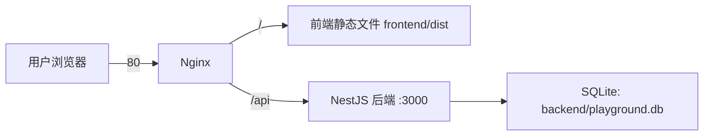

# 部署文档（线上环境）

> 本文档记录线上部署的完整情况，供任何电脑上的开发者/AI 助手理解当前部署架构。
> 最后更新：2026-08-03

## 1. 线上地址

- **访问地址**：http://122.51.253.204 （80 端口，直接访问）
- **API 入口**：http://122.51.253.204/api/*（Nginx 反代到后端）

## 2. 服务器信息

| 项目 | 值 |
|---|---|
| 云厂商 | 腾讯云轻量应用服务器（4核4G，到期 2027-08-03）|
| IP | 122.51.253.204 |
| 系统 | Ubuntu 22.04.5 LTS（glibc 2.35）|
| 登录用户 | ubuntu（sudo 免密）|
| 登录方式 | **SSH 密钥**（密码认证不可用/被拒）|
| 私钥位置 | 项目根目录 `.deploy-tmp/deploy_key`（已 gitignore，换电脑只需把这一个文件放进同样的位置）|

## 3. 服务器架构



- **Nginx**：监听 80 端口；`/` 托管前端 dist；`/api` 反代到 127.0.0.1:3000
  - 配置文件：`/etc/nginx/sites-available/playground`（已软链到 sites-enabled）
- **后端**：NestJS，PM2 守护，进程名 `python-playground-backend`
  - 启动入口：`/home/ubuntu/python-playground/backend/dist/src/main.js`（注意是 dist/src 不是 dist）
  - 已 `pm2 save`，开机自启
- **数据库**：SQLite 文件 `/home/ubuntu/python-playground/backend/playground.db`
  - `synchronize: true`，表结构自动同步；关卡数据已 seed（12 关）
  - **部署时绝不能删除此文件**（redeploy.py 已排除）

## 4. 如何更新线上代码（一键部署）

在项目根目录执行：

```powershell
python deploy/redeploy.py
```

脚本路径自动识别，可在任意电脑上运行。

脚本流程（约 1 分钟）：
1. 本地打包（排除 node_modules、dist、.git、.deploy-tmp、playground.db）
2. SFTP 上传到服务器 /tmp，rsync 同步到 `/home/ubuntu/python-playground/`（保留数据库和 node_modules）
3. `npm install`，**自动检测并把 sqlite3 强制回退到 5.1.7**
4. 依次构建 shared / backend / frontend
5. `chmod a+rX` 修复 dist 权限（Nginx www-data 需要读权限，否则 500）
6. `pm2 restart` + 验证 80/3000 端口

前置条件：
1. 本机 Python 已装 paramiko（`pip install paramiko`）
2. 项目根目录下存在 `.deploy-tmp/deploy_key` 私钥文件（微信/U盘传递，切勿进 Git）

## 5. 关键坑点（必读）

1. **sqlite3 版本分裂**：
   - 本地（Windows + Node 24）必须用 `sqlite3@6.0.1`（package.json 中已配置）
   - 服务器必须用 `sqlite3@5.1.7`：6.x 预编译二进制需要 GLIBC 2.38，Ubuntu 22.04 只有 2.35，会报 `version 'GLIBC_2.38' not found`
   - redeploy.py 会自动处理这个差异，**不要手动在服务器上 npm install 新版 sqlite3**
2. **本地 npm 有 allow-scripts 安全策略**：新电脑首次 `npm install` 后若 sqlite3 报错，执行 `npm approve-scripts sqlite3`（及 @nestjs/core、esbuild）
3. **Nginx 500**：如果 `/home/ubuntu` 权限被改回 700，www-data 读不到 dist，需要 `chmod 755 /home/ubuntu`
4. **防火墙**：腾讯云轻量防火墙需放行 80（已默认放行）；如改端口记得在控制台防火墙加规则
5. **部署私钥**：`.deploy-tmp/deploy_key` 已 gitignore，不会也不应进入 Git；部署脚本已随仓库分发（`deploy/redeploy.py`）

## 6. 服务器常用运维命令（SSH 登录后）

```bash
pm2 status                                  # 查看后端状态
pm2 logs python-playground-backend          # 看后端日志
pm2 restart python-playground-backend       # 重启后端
sudo systemctl reload nginx                 # 重载 nginx
sudo tail /var/log/nginx/error.log          # nginx 错误日志
cd /home/ubuntu/python-playground/backend && npx ts-node src/seed/run-seed.ts  # 重新 seed 关卡
```

## 7. 新电脑接入清单（换电脑时照这个做）

### 首次克隆（新电脑从未拉过代码）

```powershell
git clone https://github.com/lan7622017/python-playground.git
cd python-playground
```

### 已有克隆（只需拉取最新）

```powershell
cd python-playground
git pull
```

### 环境搭建清单（按顺序执行）

| 步骤 | 操作 | 说明 |
|---|---|---|
| 1 | 项目根目录新建 `.deploy-tmp` 文件夹，把 SSH 私钥存为 `deploy_key`（无后缀）| 私钥不进 Git，需微信/U盘传递；只需这一个文件 |
| 2 | `pip install paramiko` | 部署脚本运行依赖 |
| 3 | `npm install` | 若 sqlite3 报错：`npm approve-scripts sqlite3` 后重装 |
| 4 | `npm run dev` | 本地开发：后端 :3000 + 前端 :5173（Vite 代理 /api）|

### 日常节奏（铁律）

```powershell
# 开始写之前（拿到另一台电脑的最新代码）
git pull

# 写完之后
git add -A
git commit -m "描述改了什么"
git push

# 改完想上线（自动上传/构建/重启，约 1 分钟，不碰数据库）
python deploy/redeploy.py
```

- 本地数据库：`backend/playground.db`（gitignore，各电脑独立，不互相同步）
- 前端请求走相对路径 `/api`，dev 时由 vite.config.ts 代理到 3000

## 8. 数据说明

- 云端数据库与本地数据库**互相独立**。本地测试账号（如 test_user_001）不会自动出现在云端
- 云端已注册的账号存在服务器 playground.db 中，常规 redeploy 不会丢失
